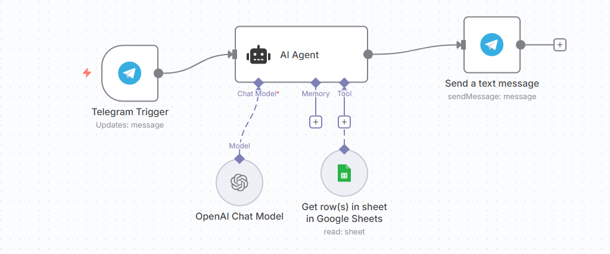

# 🤖 n8n Workflow: AI Telegram Support Bot

## Description

This workflow connects a **Telegram Bot** with **OpenAI (or Gemini)** through n8n to act as a **sales support assistant** for an online store.  
It processes customer messages using a custom **guideline** and responds in a friendly, brand-aligned tone.  
It can also fetch product prices and purchase links from **Google Sheets** and send them back to the user via Telegram.

---

## 🚀 Workflow Overview



### Workflow Steps

1. **Trigger – Telegram “On New Message”**  
   - Activates whenever a user sends a message to your Telegram bot.  
   - The bot token is obtained from **BotFather** inside Telegram.

2. **AI Agent – Process Customer Message**  
   - Uses **OpenAI (GPT-4 mini)** or **Gemini** to understand the user’s message.  
   - Input sources:
     - **User Message:** Telegram text  
     - **System Message (Guideline):** A custom rulebook defining:
       - Tone and personality  
       - When to greet  
       - How to handle angry users  
       - How to respond when product is available or unavailable  

3. **Google Sheets – Product Data Lookup**  
   - Connected using Google Cloud credentials.  
   - Provides product prices and purchase links for accurate, real-time responses.

4. **Send Message – Telegram**  
   - Sends the AI-generated reply back to the customer.

---

## 🧠 Example Guideline (System Message)

```text
You are a polite and helpful sales assistant for Zahra’s online store.
- Greet the user only in the first message.
- Use a friendly and professional tone.
- If the user is upset, respond calmly and kindly.
- If asked about prices, check Google Sheets data and provide the price and purchase link.
- If the product does not exist, apologize and inform them it’s unavailable.
```

---

## ⚙️ Setup Instructions

### 1. Create Telegram Bot
- Open Telegram and search for **BotFather**
- Run `/newbot` and follow the steps
- Copy the **Access Token**
- Add it inside n8n → Telegram Credentials → *Access Token*

### 2. Configure AI Agent Node
- Provider: **OpenAI** (or Gemini)  
- Model: `gpt-4-mini`  
- Get API Key from: https://auth.openai.com  
- Set **Source for Prompt:** User’s Telegram Message  
- Paste your **Guideline** into the *System Message* field

### 3. Connect Google Sheets
- In n8n, add new Google Sheets credentials  
- Authenticate using your **Google Cloud Secret Key**  
- Connect your sheet (example: `product_data`) with columns:
  - `Product`
  - `Price`
  - `Link`

### 4. Send Telegram Message
- Use the **Telegram → Send Message** node to reply to the user  
- Content = AI Agent's output

### 5. (Optional) Add Monitoring or Scheduling
- Scheduler node for timed resets  
- Error catcher for stability

---

## 🧩 Example Flow

1. User sends:  
   > “Hi, can you tell me the price of the blue shoes?”

2. AI Agent receives the message + guideline.

3. AI looks up Google Sheets and responds:  
   > “Sure! The blue shoes cost **$59**.  
   > You can order them here: https://shop.link/blue-shoes 👟”

4. If product not found:
   > “Sorry, I couldn’t find that product. Could you please share more details?”

---

## 🪄 Tech Stack

- **n8n**  
- **Telegram Bot API**  
- **OpenAI / Gemini API**  
- **Google Sheets API**  
- **Google Cloud Platform**

---

## 🔐 Credentials Used

| Service         | Credential Type  | Notes                          |
|-----------------|------------------|--------------------------------|
| Telegram        | BotFather Token  | For receiving/sending messages |
| OpenAI / Gemini | API Key          | For AI message generation      |
| Google Sheets   | OAuth Secret Key | For reading product data       |

---

## 📸 Screenshots

(Add your images here)

- `workflow-diagram.png`  
- `telegram-ai-agent-demo.png`

---

## 🧑‍💻 Author

**Zahra Raeisi**  
GitHub: https://github.com/zahraraeisi

---

## 📜 License

This project is open-source. You may use and modify it for learning and personal projects.
